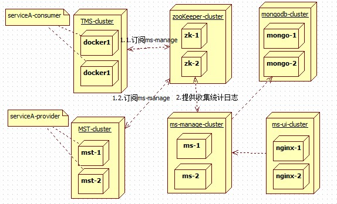
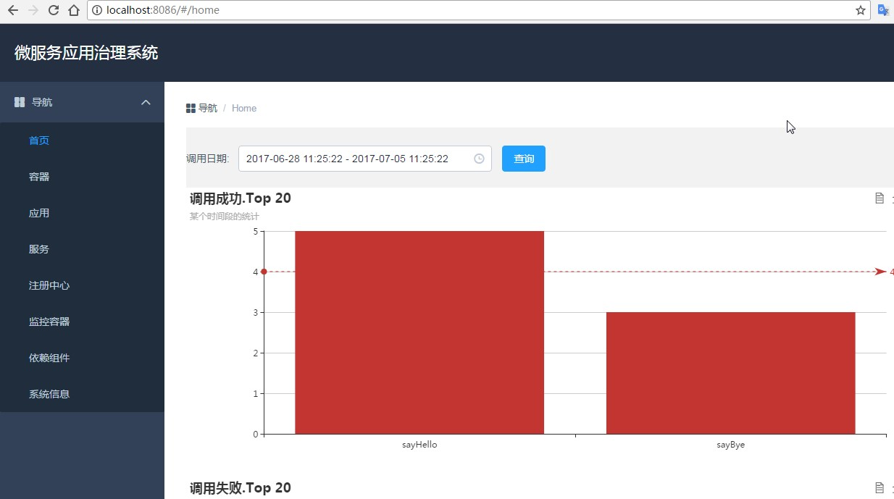

## 项目背景
	随着公司业务的发展，热衷于dubbo技术栈的童靴们也有在使用，而原生的dubbo-monitor太旧，不太符合后续版本的推进，故对前后端进行重写。

## 目标
	高性能；
	可拓展性；
	
## 后端项目：kxtx-ms-manage #
调整改进功能
- [x] 	可以持久化mongodb
- [x] 	不再是BlockingQueue，使用disruptor处理MonitorService接收到的日志
- [x]   集成SwaggerUI
- [x] 	待续

## 疑问解答
###	为什么不采用spring boot actuator进行二次开发呢？
	首先，这是2个不同领域的东西（小而美也是一种取舍），spring boot actuator一方面是不太安全，另一方面就是运维未来规划冲突(已有大量docker成套的监控)。

### 为什么不重写dubbo-core中monitor的consumer端？
	更新同步官方版本（一直是dubbo-2.5.3，迟早会更新的）的方便性及兼容性，更新com.alibaba.dubbo.monitor.MonitorService的contract必要性不太大。

### 为什么不开发链路追踪系统？
	这是两个同领域的监控，链路追踪系统开源的产品比较多，功能也丰富，重造轮子意义也不太大，使用

## 设计

	
## 使用帮助
Step1：创建mongodb的数据库（注：项目首次启动会创建表）
Step2: 编辑项目中application.properties
Step3：consumer及provider增加配置<dubbo:monitor protocol="registry"/>

## 尚未解决
- [x] 集群部署下登录会成问题(采用spring-security简单验证)，调整为JWT

## 前端项目：kxtx-ms-www #

> 基于dubbo开源框架提供的管理及监控应用

### 目录结构介绍 ##
	|-- build                            // webpack配置文件
	|-- config                           // 项目打包路径
	|-- src                              // 源码目录
	|   |-- components                   // 组件
	|       |-- common                   // 公共组件
	|           |-- Header.vue           // 公共头部
	|           |-- Footer.vue          // 公共尾部
	|           |-- Home.vue           	 // 公共路由入口
	|           |-- Sidebar.vue          // 公共左边栏
	|		|-- page                   	 // 主要路由页面
	|           |-- Application.vue      
	|           |-- Host.vue         
	|           |-- Index.vue        
	|           |-- Registy.vue          	 
	|           |-- Server.vue         
	|           |-- Service.vue        
	|           |-- Status.vue           
	|           |-- System.vue                 
	|   |-- App.vue                      // 页面入口文件
	|   |-- main.js                      // 程序入口文件，加载各种公共组件
	|-- .babelrc                         // ES6语法编译配置
	|-- .editorconfig                    // 代码编写规格
	|-- .gitignore                       // 忽略的文件
	|-- index.html                       // 入口html文件
	|-- package.json                     // 项目及工具的依赖配置文件

### 开发运行 ##
``` bash
#### 安装步骤
cd dubbo-www
npm install

#### 代码规范检查
npm run lint

#### 开启服务器，浏览器访问 http://localhost:8080
npm run dev

// 构建生产，生成的dist文件夹放在服务器下即可访问
npm run build

``` 
### 组件使用说明 ###

#### vue-router ###
路由插件

#### element-ui ###
一套基于vue.js2.0的桌面组件库

#### vuex ###
vue组件通讯组件

#### axios ###
ajax通讯组件

#### vue-validator ###
前端验证控件

添加mock
添加loading

